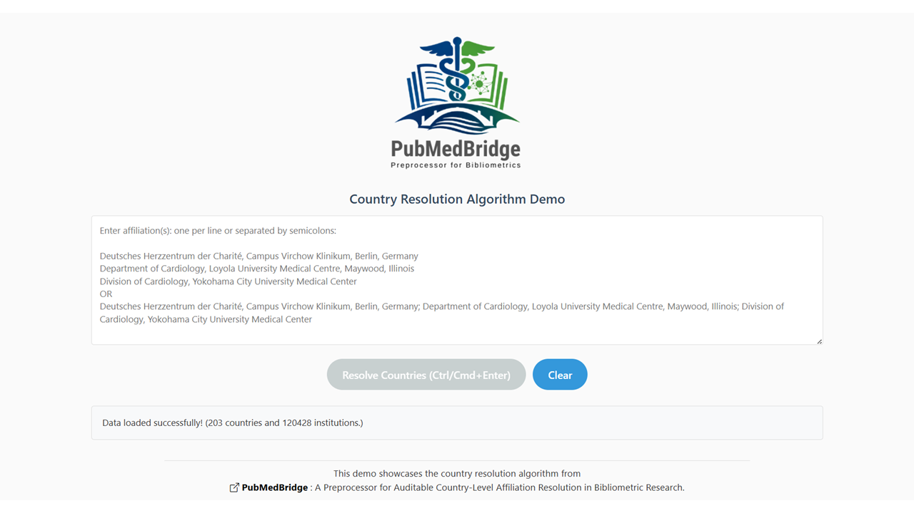
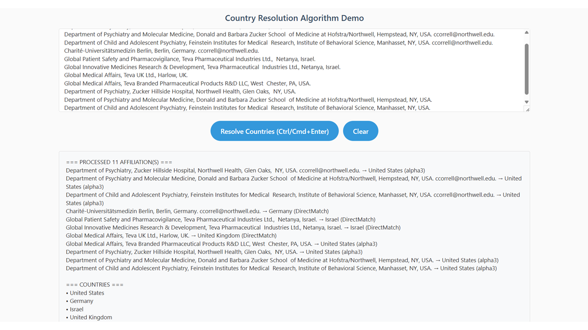

# PubMedBridge - Country Resolution Algorithm

A browser-based showcase for the PubMedBridge country resolution algorithm.

This project accompanies **PubMedBridge: _A Preprocessor for Auditable Country-Level Affiliation Resolution in Bibliometric Research_** exposing the exact country-resolution logic used in the full system through a front-end–only interface.

This README is intended for the users of this algorithm showcase.

- Maintainers and contributers should refer to [`DEVELOPMEMT.md`](./DEVELOPMENT.md)
- For a full description of how the algorithm was validated, including the study design and results, see [`VALIDATION.md`](./VALIDATION.md).

---

## Overview

This repository provides an interactive interface of the PubMedBridge country resolution algorithm, intended specifically for **validation, inspection, and methodological transparency**.
It illustrates how country assignments are produced from PubMed affiliation strings using a **conservative, hierarchical, rule-based approach**.

This interface is **not** the full PubMedBridge system and is **not intended for production use**.

---

## In the face of ambiguity, refuse the temptation to guess

_Peters, T. (2004). PEP 20: The Zen of Python. Python Software Foundation. https://peps.python.org/pep-0020/_

This algorithm embodies this principle from Python's Zen, prioritizing precision over speculation in bibliometric workflows. Ambiguous cases flag explicitly for human review, ensuring transparency, reproducibility, and zero false positives from guesswork.

1. **Hierarchical Resolution**: Progresses through six tiers of increasingly sophisticated matching—from simple direct keyword hits to advanced database lookups—resolving only high-confidence cases automatically.
2. **Conservative Assignment**: Rejects inference for ambiguities, flagging them for interactive validation to maintain analytical reliability.
3. **Complete Auditability**: Tags every assignment with its exact resolution method and confidence score, enabling full traceability at the record level.

---

## Live Access

- **Full PubMedBridge:** https://pubmedbridge.drmyo.com
- **Algorithm Showcase:** https://pmbalgorithm.drmyo.com

The software runs entirely in the browser.
No installation or backend services are required.

---

## The Showcase

This algorithm showcase exposes **rule-based country resolution outputs** for each affiliation string, including:

- Assigned country (if resolved)
- Resolution method used (e.g., `DirectMatch`, `USStateAbbr`, `InstitutionName`)
- Explicit flags for ambiguity and unresolved cases

This allows users to **audit and validate algorithmic decisions** at the individual-affiliation level.

---

## The Six-Tier Resolution Cascade

The algorithm processes each affiliation string through the following steps in sequence:

#### Affiliation string standardization and metadata cleaning

Affiliation strings are standardized and cleaned prior to country detection to minimize parsing artifacts while retaining geographic cues.:

- **Standardizes text**: Converts diacritical marks to ASCII (e.g., "München" → "Munchen"), normalizes abbreviations ("U.S.A." → "USA", "U.K." → "UK"), collapses multiple spaces
- **Removes non-geographic content**: Email addresses, phone numbers, postal codes, URLs, institutional identifiers (ORCID, ROR, ISNI, GRID, Ringgold), etc.

#### Step 1. Direct Country Name Match (`DirectMatch`)

- Matches standardized country names or common aliases
- Disambiguation for ambiguous names (e.g., _Georgia (Country)_ vs. _Georgia (US State)_, _Mexico (Country)_ vs. _New Mexico (US State)_, _Republic of Korea_ vs. _Democratic Republic of Korea_, etc.)

**Example:**

```
PMID    41287969
Input:  Inner Mongolia People's Hospital, Hohhot, China.
Output: Inner Mongolia People's Hospital, Hohhot, China. → China (DirectMatch)

PMID    41150973
Input:  Servicio de Neumología, Hospital Universitario Gregorio Marañón. Madrid, España. Universidad Complutense de Madrid. Madrid, España.. lopez.padilla84@gmail.com.
Output: Servicio de Neumología, Hospital Universitario Gregorio Marañón. Madrid, España. Universidad Complutense de Madrid. Madrid, España.. lopez.padilla84@gmail.com. → Spain (DirectMatch)

PMID    41415651
Input:  Department of Radiology, Seoul National University Hospital, Seoul, Korea.
Output: Department of Radiology, Seoul National University Hospital, Seoul, Korea. → Republic of Korea (DirectMatch)

PMID    30904107
Input:  Pyongyang Medical College, Kim Il Sung University, Pyongyang, North Korea.
Output: Pyongyang Medical College, Kim Il Sung University, Pyongyang, North Korea. → Democratic People's Republic of Korea (DirectMatch)
```

#### Step 2. ISO Alpha-3 Code Match (`Alpha3`)

- Detects ALL CAPS three-letter ISO 3166 country codes

**Example:**

```
PMID    41306164
Input:  Cardiology, Vardhman Mahavir Medical College and Safdarjung Hospital, Delhi, IND.
Output: Cardiology, Vardhman Mahavir Medical College and Safdarjung Hospital, Delhi, IND. → India (alpha3)
```

- However, non-ALL CAPS words will not be resolved.

**Example:**

```
PMID    39617318
Input:  Department of Cardiovascular and Thoracic Surgery, Franciscan St Francis Health, Indianapolis, Ind.
Output: Department of Cardiovascular and Thoracic Surgery, Franciscan St Francis Health, Indianapolis, Ind. → IND (UNRESOLVED)
```

#### Step 3. U.S. State Name (`USStateName`)

- Assigns **United States** based on full U.S. state names

**Example:**

```
PMID    41337715
Input:  Columbia University Irving Medical Center, New York.
Output: Columbia University Irving Medical Center, New York. → United States (USStateName)
```

#### Step 4. U.S. State Abbreviation (`USStateAbbr`)

- Assigns **United States** based on two-letter postal codes

**Example:**

```
PMID    41320817
Input:  Intra-Cellular Therapies, a Johnson & Johnson Company, Bedminster, NJ.
Output: Intra-Cellular Therapies, a Johnson & Johnson Company, Bedminster, NJ. → United States (USStateAbbr)
```

- Non-postal abbreviations (e.g., _Calif._, _Tex._, _Ill._) are intentionally not matched.

**Example:**

```
PMID    39617318
Input:  Robotic Cardiac Surgery, The Heart Hospital Baylor Plano, Plano, Tex.
Output: Robotic Cardiac Surgery, The Heart Hospital Baylor Plano, Plano, Tex. → TEX (UNRESOLVED)
```

#### Step 5. Institution Name (`InstitutionName`)

- Matches institution names, aliases, and acronyms against the embedded [`reference institution dataset`](./institutionList.json).
  **Example:**

```
PMID    41297007
Input:  Internal Medicine Department, Ramón y Cajal University Hospital, Instituto Ramón  y Cajal de Investigación Sanitaria, Madrid.
Output: Internal Medicine Department, Ramón y Cajal University Hospital, Instituto Ramón  y Cajal de Investigación Sanitaria, Madrid. → Spain (Instituto Ramón y Cajal de Investigación Sanitaria - InstitutionName)

PMID    41342326
Input:  Division of Gastroenterology, Hepatology and Nutrition, San Salvatore Hospital, Department of Life, Health & Environmental Sciences, University of L'Aquila, L'Aquila.
Output: Division of Gastroenterology, Hepatology and Nutrition, San Salvatore Hospital, Department of Life, Health & Environmental Sciences, University of L'Aquila, L'Aquila. → Italy (University of L'Aquila - InstitutionName)
```

_NOTE:_ In cases where an institution exists in multiple countries but only one instance is present in the reference database, the algorithm assigns the country based on the database entry. As a result, an institution that actually belongs to another country may be assigned the country listed in the database.

**Example:**

```
Both below are incorrect (False Positive) assignments
PMID    41342326
Input:  Department of Medical and Surgical Sciences, School of Medicine, Catholic University, Rome.
Output: Department of Medical and Surgical Sciences, School of Medicine, Catholic University, Rome. → Brazil (Pontifícia Universidade Católica de São Paulo - InstitutionName)

PMID    41015998
Input:  Medical Student, Lee Kong Chian School of Medicine, National Technological  University.
Output: Medical Student, Lee Kong Chian School of Medicine, National Technological  University. → Argentina (National Technological University - InstitutionName)
```

_NOTE:_ In these cases, the institution name in the affiliation matches only one entry in the reference database:

- For PMID 41342326, "Catholic University" is an alias for **Pontifícia Universidade Católica de São Paulo** in Brazil. The actual institution in the affiliation is more likely to be **Università Cattolica del Sacro Cuore** in Rome, Italy, but this name or alias is not present in the database.

- For PMID 41015998, "Lee Kong Chian School of Medicine, National Technological University" is resolved to **National Technological University** in Argentina according to the database. The actual institution is in **Singapore**, but it is not represented in the reference institution dataset.

These examples illustrate a limitation: when an institution exists in multiple countries but only one instance is in the reference database, the country assignment is based on the database entry, which may differ from the real location.

- However, when exact institution name in more than one country, and the algorithm cannot disambiguate among them, it is flagged as `InstitutionNameConfusion`

**Example**

```
PMID    39828350
Input:  Boston Scientific Corporation.
Output: Boston Scientific Corporation. → BOSTON SCIENTIFIC CORPORATION (InstitutionNameConfusion)
```

_NOTE_: Boston Scientific Corporation is in the Institution dataset and appears in multiple countries: Barbados, Belgium, Germany, The Netherlands, United States

**Conflict Resolution — City Override**

- If city-based evidence contradicts an institution-based match, the city-based assignment takes precedence

```
PMID    29036613
Input:  Department of Radiation Oncology, National Cancer Center Hospital, Tokyo
Output: Department of Radiation Oncology, National Cancer Center Hospital, Tokyo → Japan (Tokyo – InstitutionCity)
```

_NOTE_: After Step 5, the string is provisionally assigned to the Republic of Korea because the institution dataset contains only one "National Cancer Center Hospital," located in South Korea"(Republic of Korea), and no corresponding institution in Japan. The subsequent conflict-resolution step (_City Check and Institution–City Override_) correctly reassigns the affiliation to Japan based on the city identifier "Tokyo."

#### Step 6. Institution City Name (`InstitutionCity`)

- Assigns country based on institution city names

```
PMID    38569127
Input:  Regional Epilepsy Centre (E.F.), "Bianchi-Melacrino-Morelli" Great Metropolitan Hospital, Reggio Calabria
Output: Regional Epilepsy Centre (E.F.), "Bianchi-Melacrino-Morelli" Great Metropolitan Hospital, Reggio Calabria → Italy (Reggio Calabria - InstitutionCity)
```

- City names shared across multiple countries trigger `InstitutionCityConfusion` flags

```
PMID    38566437
Input:  Institute of Medical Biometry, Heidelberg University Hospital, Heidelberg
Output: Institute of Medical Biometry, Heidelberg University Hospital, Heidelberg → HEIDELBERG (InstitutionCityConfusion)
```

_NOTE_: "Heidelberg University Hospital" is not in institution dataset. Heidelberg is in Australia, Germany.

After Step 6, the algorithm checks for:

- Contribution notes lacking geographic information (e.g., _"a, b and c contributed equally…"_)

```
PMID    38901883
Input:  M. Stahl, M. Dohna, S.Y. Graeber and O. Sommerburg contributed equally as first  authors.
Output: M. Stahl, M. Dohna, S.Y. Graeber and O. Sommerburg contributed equally as first  authors. →  (ContributionNote)
```

- Filtered non-affiliation strings (e.g., _"and."_)

```
PMID    40570276
Input:  and.
Output: and. → (FilteredString)
```

If all above steps fails, the affiliation string is assigned `UNRESOLVED`.

- However, the presence of **_UNRESOLVED_** outcomes should be interpreted as an explicit signal of ambiguity rather than a failure of the algorithm. These cases are intentionally preserved for targeted manual validation.

---

### 3. Resolution Confidence Levels

Each resolution method is categorized into one of three confidence levels: to enables users to **prioritize manual validation**, focusing on low- and no-confidence cases.

#### High-confidence (Steps 1–4)

Relies on explicit, standardized geographic identifiers (country names, ISO codes, U.S. states) that commonly appear in predictable locations (i.e., at the end of the affiliation string).

#### Low-confidence (Steps 5–6)

Uses institution and city name matching with [`reference institution dataset`](./institutionList.json), which faces challenges from:

- Linguistic variation and lack of standardization
- Identical names across countries on ground
  - Only one institution is in the database leading to incorrect assignment
  - More than one institution with the same name in different countries leading to _InstitutionNameConfusion_
- Unpredictable placement within affiliation strings
- Incomplete or outdated reference data

There are 1,413 institutions with [`idential institution names`](./Data/multi_country_institutions.txt) in more than one country .

There are 367 cities with [`identical city names`](./Data/multi_country_cities.txt) in more than one country.

#### No-confidence

Includes genuine ambiguities, contribution notes, and affiliation strings resistant to systematic parsing.

---

## Reference Institution Dataset

Institution-based and city-based resolution relies on a unified reference institution dataset compiled from:

- **Research Organization Registry (ROR)** [https://ror.org](https://ror.org)
- **OpenAlex** [https://openalex.org](https://openalex.org)

### Dataset Construction

- **ROR v1.74** (downloaded 15 Dec 2025): Mininized to essential fields (institution name, aliases, city, country), yielding **120,196 institutions**

- **OpenAlex** (downloaded 15 Dec 2025): Extracted and standardized to the same schema, yielding **115,781 institutions** (8,072 without country data)

The two datasets were merged by institution name and matching country.
Aliases were combined, duplicates removed, and records with non-null country data were prioritized.

The final unified reference institution dataset contains **120,428 institutions**.

---

## Input

- Plain-text affiliation strings
- One affiliation per line OR separated by semicolons

  

---

## Output

- Assigned country (if resolved)
- Resolution status (`resolved` / `unresolved` / `ambiguous`)

  

---

## Limitations

- This showcase is **only for validation of algorithmic output**
- The resolution logic [`countryResolver.js`](./countryResolver.js) is identical to the full PubMedBridge system, but:
  - The UI is simplified
  - The output format differs
    (full PubMedBridge exports XLSX with additional fields)
- Not optimized for large-scale processing
- Not intended as a standalone production tool

---

## Intended Use

This demo is intended for:

- Validation of country resolution behavior
- Methodological transparency
- Supplementary material for publications

---

## License

This software is released under the MIT License.

---
